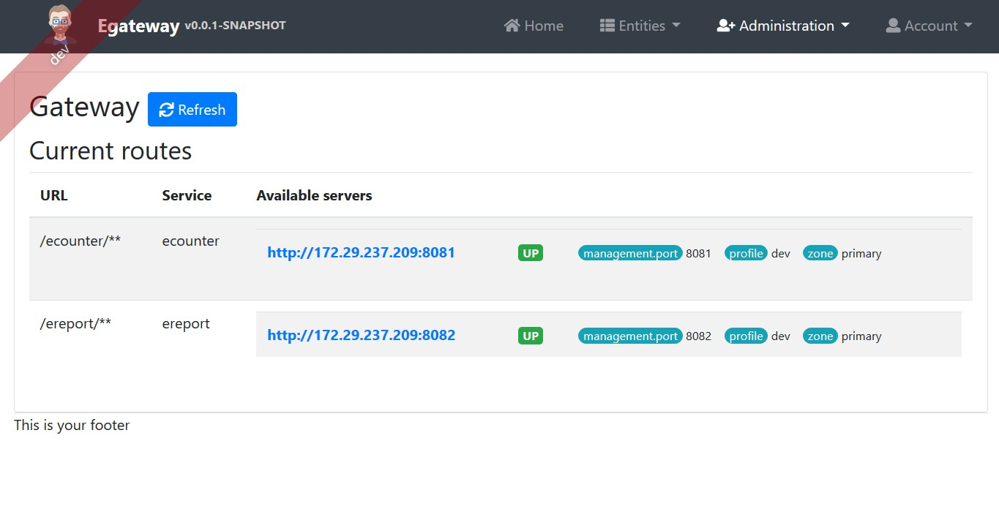

# Problem definition

You have to design and build the system that allows to receive and collect data about energy consumption from different villages. As a result, your system should, on demand, give out the consumption report per village for the last 24h. As a result of your work, we expect the end-to-end design of the system (a model, system architecture, technology, and frameworks choice, testing strategy, etc.). We would also like to see your code for the whole system or reasonable part of it. However, if you have a project (at least as complex as this task) on GitHub with a problem statement, then you can share it with us as well.

```
Consider that your system has an API that is called by electricity counters:
POST /counter_callback
{
    "counter_id": "1",
    "amount": 10000.123
}
To get information additional information about the counter you have to call the following external API:
GET /counter?id=1
{
    "id": "1",
    "village_name": "Villarriba"
}
As a result, it's expected that your system will expose the following API:
GET /consumption_report?duration=24h
{
    "villages": [
        {
            "village_name": "Villarriba",
            "consumption": 12345.123
        },
        {
            "village_name": "Villabajo",
            "consumption": 23456.123
        }
    ]
}    
```


# Solution walk through 

## Domain object

Since this is a simple project, I didn't design and store `report` data on ereport microservices (which later can be a consideration if already generated certain report format)

Data for counter and consumption however are store on `ecounter` service, here is a simple model of this data structure: 


## Architecture

I designed 2 microservices `ecounter`  (short for energy-counter) and `ereport` (short for energy report) and a gateway service (egateway) to deal with external request from clients


To split the responsibility, ecounter takes care of updating counter consumption data, as well as providing counter details, while ereport will take care of report generation (in the future) -> that is why the separation. 

When all running, the service register itself with a jHipster Registry, and appear itself on the Gateway screen



## Microservices communication

With microservices it is important for each service to handle its own data. No cross functioning, therefore ereport service would need to communicate through the API gateway (egateway) as well, this is to avoid direct service communication which could lead to authorization and authentication issues later on. 


## Microservices API

It is important for each service to expose its API, with the help of Swagger, API docs for each service is available through its swagger meta info


# How to run and test

Since there are many component and I don't have yet time to write a bootstrap script for docker/terminal yet, we can test run the test manually by going to each directories and fire up `mvn test` for testing, or `mvn` for running in dev mode. 


API and interface for counter (generated by jhipster using AngularJS)


There is also a nice interface to input consumption for counter. 


Since time is limited and I want to focus more onto the architectural aspects, I just create an aggregate feature to generate json-based report like this. 

It is obviously not finished yet and report service should generate PDF or jasperReport instead. 


Thank you for reading.